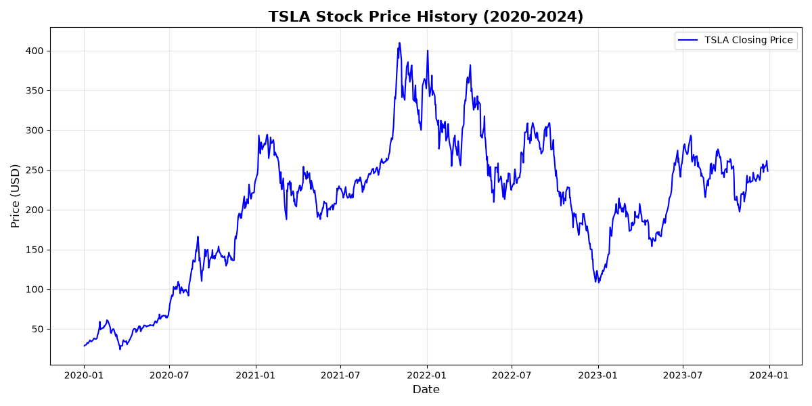
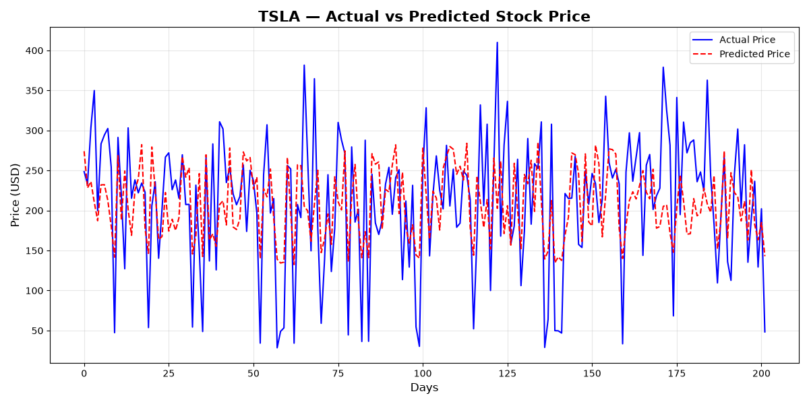

# 📈 Stock Price Prediction — Machine Learning Project

An end-to-end Machine Learning project that predicts future stock prices using Linear Regression, trained on real historical data fetched from Yahoo Finance.

---

## 🎯 What It Does

Enter any stock symbol → System automatically:
1. Downloads real historical stock data from Yahoo Finance
2. Visualizes price history with interactive graphs
3. Trains a Linear Regression ML model on historical data
4. Evaluates model accuracy using MAE and R2 Score
5. Predicts next 30 days of stock prices
6. Visualizes Actual vs Predicted prices on graph

---
## 📊 Sample Output







## 🛠️ Tech Stack

- **Python** — Core programming language
- **yfinance** — Fetches real-time stock data from Yahoo Finance
- **pandas** — Data manipulation and preprocessing
- **scikit-learn** — Linear Regression ML model and evaluation metrics
- **matplotlib** — Data visualization and graph plotting
- **numpy** — Numerical computations and array operations

---

## 📁 Project Structure
StockPricePrediction/
│
├── data_loader.py      # Downloads and cleans stock data
├── visualizer.py       # Draws price history and prediction graphs
├── model.py            # Trains ML model and predicts prices
├── main.py             # Runs complete pipeline end to end
└── requirements.txt    # Required Python libraries

---

## ⚙️ How To Run

**1. Clone the repository**
```bash
git clone https://github.com/LikhithaRavuri5/StockPricePrediction.git
cd StockPricePrediction
```

**2. Install dependencies**
```bash
pip install -r requirements.txt
```

**3. Run the project**
```bash
python main.py
```

---

## 🤖 ML Concepts Used

- **Linear Regression** — Learns pattern from historical prices and predicts future values
- **Train/Test Split** — 80% data for training, 20% for testing model accuracy
- **Mean Absolute Error (MAE)** — Measures average prediction error in dollars
- **R2 Score** — Measures how well model explains price movement patterns
- **Feature Engineering** — Converting dates to numerical day numbers for ML model

---

## 📈 Graphs Generated

**Graph 1 — Stock Price History:**
Shows how Tesla stock price moved from 2020 to 2024 including the peak in 2021.

**Graph 2 — Actual vs Predicted:**
Compares real stock prices with ML model predictions to visualize accuracy.

---

## 💡 Future Improvements

- Implement LSTM (Deep Learning) for better accuracy
- Add multiple stock comparison
- Build Streamlit web interface for live predictions
- Include technical indicators (Moving Average, RSI)

---

## 👩‍💻 Author

**Likhitha Ravuri**  
IT Student | Vishnu Institute of Technology  
GitHub: [@LikhithaRavuri5](https://github.com/LikhithaRavuri5)
Press Ctrl + S
Then push to GitHub:
git add .
git commit -m "Add README file"
git push
Tell me once done! 😊
---

## 🛠️ Tech Stack

- **Python** — Core programming language
- **yfinance** — Fetches real-time stock data from Yahoo Finance
- **pandas** — Data manipulation and preprocessing
- **scikit-learn** — Linear Regression ML model and evaluation metrics
- **matplotlib** — Data visualization and graph plotting
- **numpy** — Numerical computations and array operations

---

## 📁 Project Structure

---
StockPricePrediction/
│
├── data_loader.py      # Downloads and cleans stock data
├── visualizer.py       # Draws price history and prediction graphs
├── model.py            # Trains ML model and predicts prices
├── main.py             # Runs complete pipeline end to end
└── requirements.txt    # Required Python libraries

---

## ⚙️ How To Run

**1. Clone the repository**
```bash
git clone https://github.com/LikhithaRavuri5/StockPricePrediction.git
cd StockPricePrediction
```

**2. Install dependencies**
```bash
pip install -r requirements.txt
```

**3. Run the project**
```bash
python main.py
```

---

## 🤖 ML Concepts Used

- **Linear Regression** — Learns pattern from historical prices and predicts future values
- **Train/Test Split** — 80% data for training, 20% for testing model accuracy
- **Mean Absolute Error (MAE)** — Measures average prediction error in dollars
- **R2 Score** — Measures how well model explains price movement patterns
- **Feature Engineering** — Converting dates to numerical day numbers for ML model

---

## 📈 Graphs Generated

**Graph 1 — Stock Price History:**
Shows how Tesla stock price moved from 2020 to 2024 including the peak in 2021.

**Graph 2 — Actual vs Predicted:**
Compares real stock prices with ML model predictions to visualize accuracy.

---

## 💡 Future Improvements

- Implement LSTM (Deep Learning) for better accuracy
- Add multiple stock comparison
- Build Streamlit web interface for live predictions
- Include technical indicators (Moving Average, RSI)

---

## 👩‍💻 Author

**Likhitha Ravuri**  
IT Student | Vishnu Institute of Technology  
GitHub: [@LikhithaRavuri5](https://github.com/LikhithaRavuri5)